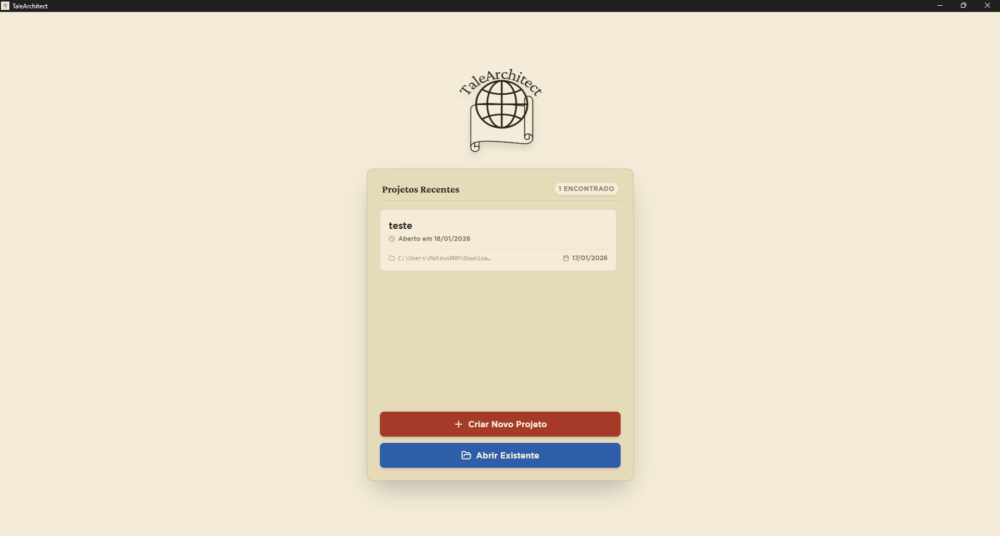
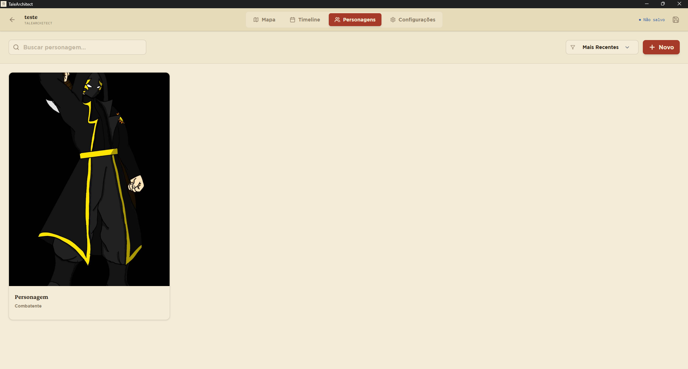
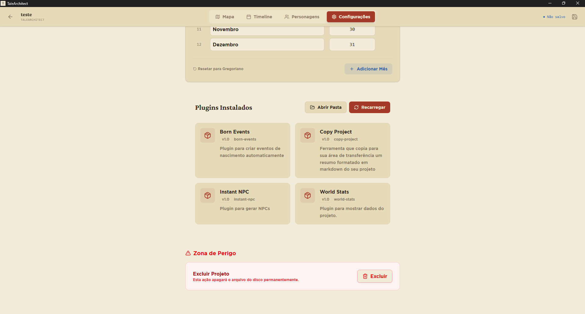

# TaleArchitect


**TaleArchitect** é uma ferramenta de construção de mundos (worldbuilding) focada em conexões e cronologia. Desenvolvida para escritores, mestres de RPG e criadores de conteúdo que precisam organizar universos complexos de forma visual e intuitiva. 

<div align="center">
  
</div>

<div align="center">
  
</div>

<div align="center">
  
</div>

<div align="center">
  
</div>

<div align="center">
  
</div>

## ✨ Funcionalidades Principais

- **🗺️ Mapa Mental Interativo:** Crie locais, arraste, solte e conecte-os visualmente. O sistema de nós permite entender a geografia e as relações do seu mundo num piscar de olhos.
- **⏳ Timeline Dinâmica:** Visualize eventos cronologicamente com suporte a calendários personalizados (dias e meses customizáveis).
- **👤 Gestão de Personagens:** Mantenha a lore e as descrições dos seus personagens.
- **⚡ Paleta de Comandos:** Acesse comandos do aplicativo com `Ctrl + K`.
- **🔌 Sistema de Plugins:** Estenda as funcionalidades do app usando JavaScript simples. Crie geradores, exportadores e automações.
- **💾 100% Offline & Seguro:** Seus dados ficam no seu computador. Suporte nativo a Autosave, Undo (`Ctrl+Z`) e Redo (`Ctrl+Shift+Z`).

## 🚀 Instalação

Baixe a versão mais recente para **Windows** ou **Linux** na aba [Releases](../../releases).

1. Baixe o instalador (`.exe` para Windows ou `.deb`/`.AppImage` para Linux).
2. Execute o instalador.
3. Pronto! O TaleArchitect está instalado.

## ⌨️ Atalhos e Comandos Essenciais

| Atalho | Ação |
| :--- | :--- |
| `Ctrl + K` | Abrir Paleta de Comandos (Busca Global) |
| `Ctrl + S` | Salvar Projeto Manualmente |
| `Ctrl + Z` | Desfazer (Undo) |
| `Ctrl + Shift + Z` | Refazer (Redo) |
| `Scroll` | Zoom no Mapa |
| `Segurar Botão Esquerdo` | Pan (Arrastar) no Mapa |
| `Duplo clique no botão esquerdo` | Adicionar nó (local) no Mapa |
| `Botão direito em cima de um local` | Criar uma conexão no Mapa |

## 🔌 Plugins e Extensibilidade

O TaleArchitect possui uma API para desenvolvedores. Você pode criar scripts para automatizar tarefas.

Para instalar um plugin:
1. Vá em **Configurações > Plugins**.
2. Clique em **Abrir Pasta**.
3. Arraste a pasta do plugin para lá.

> 📖 **Desenvolvedores:** Leia a [Documentação da API de Plugins](PLUGIN_API.md) para aprender a criar suas próprias extensões usando JavaScript.

## 🛠️ Desenvolvimento (Para Contribuidores)

Este projeto utiliza as seguintes tecnologias:
- **Back-end:** [Tauri v2](https://v2.tauri.app/)
- **Front-end:** [Svelte 5](https://svelte.dev/) + TypeScript
- **Estilização:** TailwindCSS
- **Runtime:** Bun

### Pré-requisitos
- [Rust](https://www.rust-lang.org/tools/install) instalado.
- [Bun](https://bun.sh/) instalado.
- Dependências de build do Linux (se estiver no Linux): `libwebkit2gtk-4.1-dev`, `libappindicator3-dev`.

### Rodando Localmente

```bash
# 1. Clone o repositório
git clone https://github.com/MateusRNM/TaleArchitect.git
cd TaleArchitect

# 2. Instale as dependências
bun install

# 3. Rode em modo de desenvolvimento
bun tauri dev
```

**📂 Estrutura do Projeto**

O código segue uma arquitetura limpa e desacoplada:

- ```src/lib/stores```: Gerenciamento de estado reativo (Svelte 5 Runes).

- ```src/lib/models```: Interface de dados do aplicativo.

- ```src/lib/controllers```: Lógica de negócios complexa.

- ```src/lib/services```: Serviços de infraestrutura (Bridge de Plugins, Command Registry).

- ```src/lib/components```: Componentes visuais reutilizáveis.

- ```src-tauri```: Backend em Rust (Gerenciamento de janelas e sistema de arquivos).

**OBS: Esse projeto está nas primeiras versões, e eu sou só um estudante de programação. Qualquer ajuda ou feedback será bem-vinda!**